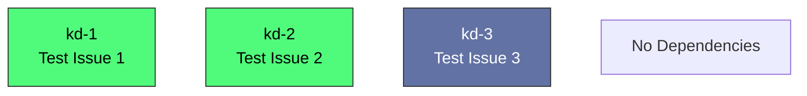

# Beads Export

*Generated: Tue, 11 Aug 2026 13:52:30 PDT*

## Summary

| Metric | Count |
|--------|-------|
| **Total** | 3 |
| Open | 2 |
| In Progress | 0 |
| Blocked | 0 |
| Closed | 1 |

## Quick Actions

Ready-to-run commands for bulk operations:

```bash
# Close all open items
br close kd-1 kd-2

# View high-priority items (P0/P1)
br show kd-1 kd-2

```

## Table of Contents

- [🟢 kd-1 Test Issue 1](#kd-1-test-issue-1)
- [🟢 kd-2 Test Issue 2](#kd-2-test-issue-2)
- [⚫ kd-3 Test Issue 3](#kd-3-test-issue-3)

---

## Dependency Graph



---

<a id="kd-1-test-issue-1"></a>

## • kd-1 Test Issue 1

| Property | Value |
|----------|-------|
| **Type** | •  |
| **Priority** | 🔥 Critical (P0) |
| **Status** | 🟢 open |
| **Created** | 0001-01-01 00:00 |
| **Updated** | 0001-01-01 00:00 |

<details>
<summary>📋 Commands</summary>

```bash
# Start working on this issue
br update kd-1 -s in_progress

# Add a comment
br comment kd-1 'Your comment here'

# Change priority (0=Critical, 1=High, 2=Medium, 3=Low)
br update kd-1 -p 1

# View full details
br show kd-1
```

</details>

---

<a id="kd-2-test-issue-2"></a>

## • kd-2 Test Issue 2

| Property | Value |
|----------|-------|
| **Type** | •  |
| **Priority** | 🔥 Critical (P0) |
| **Status** | 🟢 open |
| **Created** | 0001-01-01 00:00 |
| **Updated** | 0001-01-01 00:00 |

<details>
<summary>📋 Commands</summary>

```bash
# Start working on this issue
br update kd-2 -s in_progress

# Add a comment
br comment kd-2 'Your comment here'

# Change priority (0=Critical, 1=High, 2=Medium, 3=Low)
br update kd-2 -p 1

# View full details
br show kd-2
```

</details>

---

<a id="kd-3-test-issue-3"></a>

## • kd-3 Test Issue 3

| Property | Value |
|----------|-------|
| **Type** | •  |
| **Priority** | 🔥 Critical (P0) |
| **Status** | ⚫ closed |
| **Created** | 0001-01-01 00:00 |
| **Updated** | 0001-01-01 00:00 |

---

